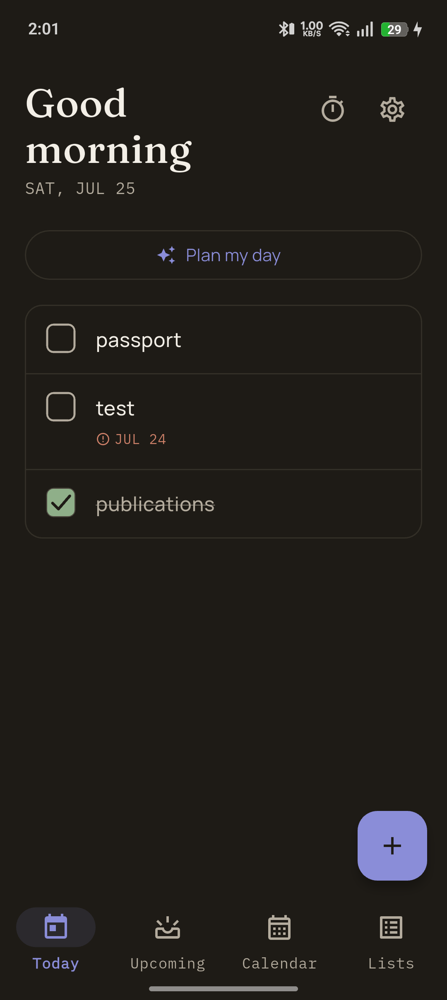
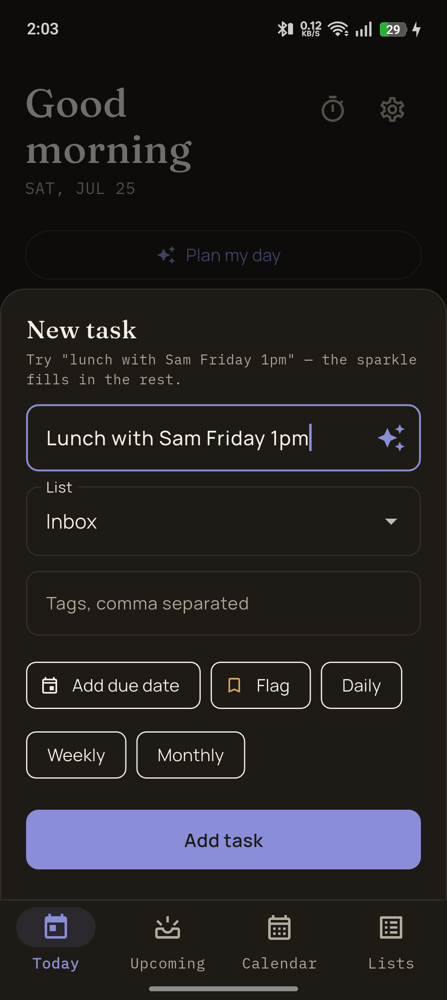
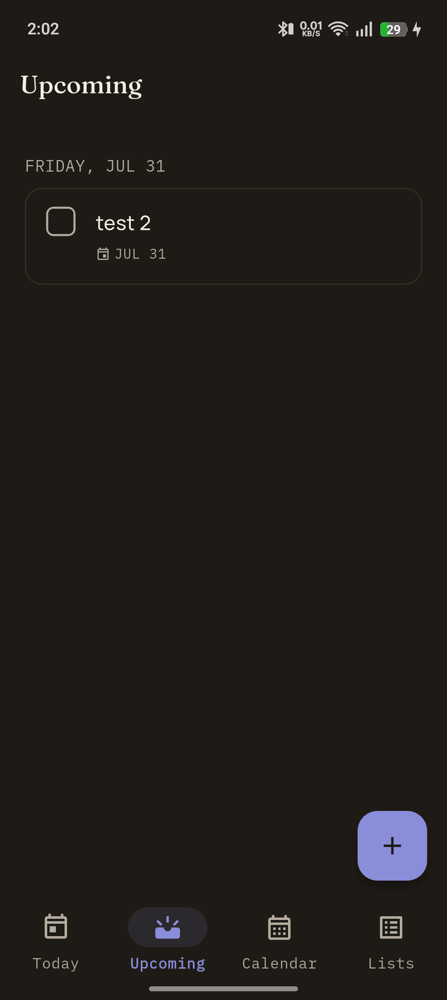
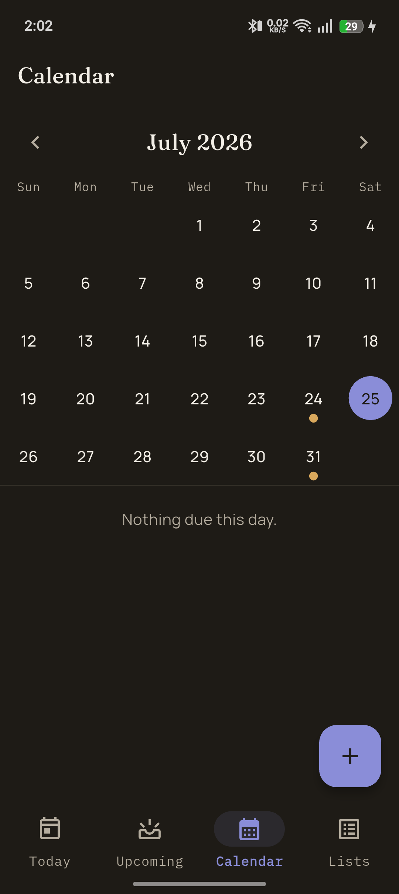
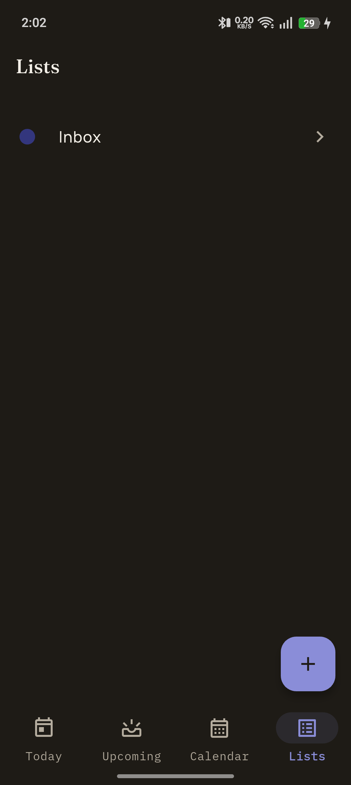

# Karm

A calm, advanced todo app for Android, built with Flutter. Local-first storage
with optional collaboration — your tasks work fully offline and sync when
you share a list with a friend.

[](https://github.com/Abhi-shekes/karm/actions/workflows/release.yml)
[](https://github.com/Abhi-shekes/karm/releases/latest)

## Screenshots

<table>
  <tr>
    <td></td>
    <td></td>
    <td></td>
  </tr>
  <tr>
    <td></td>
    <td></td>
    <td></td>
  </tr>
</table>

## Features

- **Today & Upcoming** — a Today view that always surfaces overdue tasks and
  anything without a due date, plus a separate Upcoming view for what's ahead
- **Calendar** — month view with due-date markers and a per-day agenda
- **Lists** — organize tasks into lists; share a list to collaborate with
  friends in real time via Firestore
- **Friends** — send/accept friend requests, then invite friends directly to
  shared lists
- **Subtasks, tags, flags, and recurrence** (daily/weekly/monthly)
- **AI quick-add** — type something like "lunch with Sam Friday 1pm" and let
  AI fill in the due date, tags, and flag for you
- **Focus timer** — Pomodoro-style focus sessions tied to a task
- **Reminders** — local notifications scheduled against due dates
- **Home-screen widget** — see today's tasks without opening the app
- **Offline-first** — everything is stored locally in SQLite (via Drift) and
  works with no network connection; sync is opt-in per list

## Tech stack

- [Flutter](https://flutter.dev) / Dart
- [Riverpod](https://riverpod.dev) for state management
- [Drift](https://drift.simonbinder.eu) (SQLite) for local-first storage
- [Firebase](https://firebase.google.com) — Auth, Firestore, Cloud Messaging,
  Crashlytics, Analytics, AI
- [go_router](https://pub.dev/packages/go_router) for navigation

## Download

Grab the latest APK from the [Releases page](https://github.com/Abhi-shekes/karm/releases/latest) —
a new build is published automatically on every push to `main`.

## Building from source

```bash
flutter pub get
flutter run
```

Requires a `google-services.json` in `android/app/` (Firebase project config).

## CI/CD

Every push to `main` triggers [`.github/workflows/release.yml`](.github/workflows/release.yml),
which builds a release APK and publishes it as a new GitHub Release. The
version auto-increments from the latest `vX.Y.Z` tag, starting at `v1.0.0`,
and the APK is attached as `karm_v<version>.apk`.

## Firebase configuration

`android/app/google-services.json` and the Firebase API key are no longer committed.

1. Copy the template and fill in your own project values:
   ```sh
   cp android/app/google-services.json.example android/app/google-services.json
   ```
2. Pass the Android API key at build/run time:
   ```sh
   flutter run --dart-define=FIREBASE_ANDROID_API_KEY=your-key
   flutter build apk --dart-define=FIREBASE_ANDROID_API_KEY=your-key
   ```
